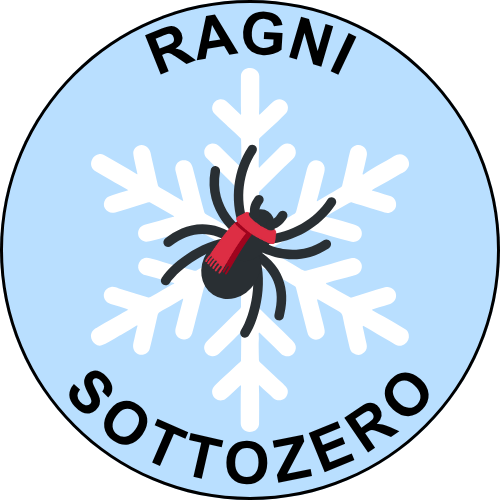

  

# Il progetto
Ragni sottozero è un progetto scientifico di Citizen Scienze che vuole descrivere l'araneofauna durante il periodo autunno-invernale, periodo scarsamente rappresetnato nella letteratura scientifica. L'area di questo studio si concentra nelle aree urbane andando a comprendere l'urbanizzazione ha un impatto sulla comunità dei ragni.
Oltre agli obettivi scientifici il progetto ha degli obiettivi educativo e didattici andando ad avvicinare gli studenti al metodo scientifico tramite una raccolta di dati diretta sul campo ed andando a sesibilizzare ed informare gli studenti su questo taxa che spesso è soggetto a disinformazione o timore da parte della popolazione.

# Citizen Science
I progetti di Citizen Science sono attività scientifiche con l’obiettivo di creare nuova conoscenza tramite il coinvolgimento diretto di volontari.

Per questo motivo i progetti di Citizen Science hanno degli obiettivi scientifici e degli obiettivi didattici:

**Obiettivi scientifici**

Studio della comunità di ragni durante il periodo autunno-invernale, un periodo scarsamente rappresentato nella letteratura scientifica e che corrisponde con il periodo di apertura delle scuole. Il secodno obiettivo scientifico è andare a valutare come l'urbanizzazione influenzi la comunità di ragni.

**Obiettivi didattici**

Il progetto vuole avvicinare gli studenti al metodo scientifico tramite la raccolta di dati direttamente sul campo ed ha anche l’obiettivo di andare a sensibilizzare ed informare gli studenti sui ragni che sono un taxa spesso soggetto a disinformazioni o timori.

## Fasi del progetto
1. Incontro introduttivo con i ricercatori per introdurre la biologia dei ragni alla classe ed accompagnarli nel loro primo campionamento
2. Fare campionamenti ripetuti una volta al mese per i mesi successivi tramite il materiale presente nell "valigetta dell'aspirante aracnologo" e poi spedirli ai ricercatori.
3. I ricercatori andranno ad analizzare i campioni ed identificare le specie ad invieranno i risultati via email alla classe.

## Cosa ti serve per partecipare?
- Un'area verde all'interno della scuola o vicino, dove sia possibile fare campionamenti ripetuti;
- Materiali e strumenti per i campionamenti che sono elencati nella "valigetta dell'aspirante aracnologo"

## Materiali

  

    
    
Documento 1

  

  

    
    
Documento 2

  

  

    
    
Documento 3

  

## Media

    
    
Instagram

## Contatti
